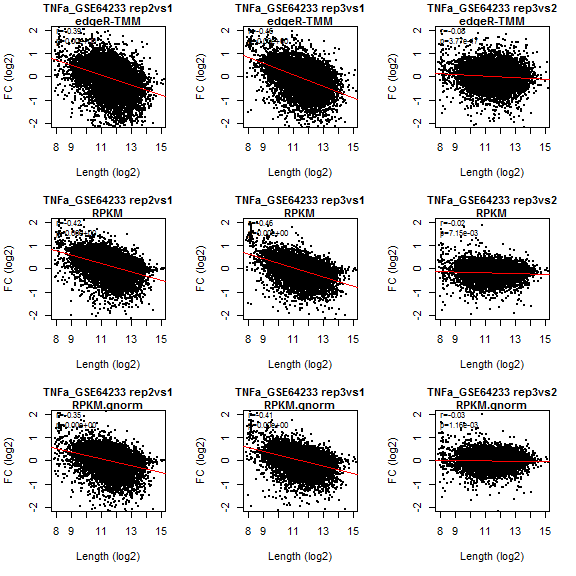
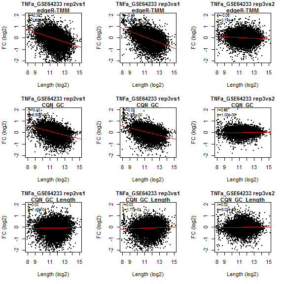
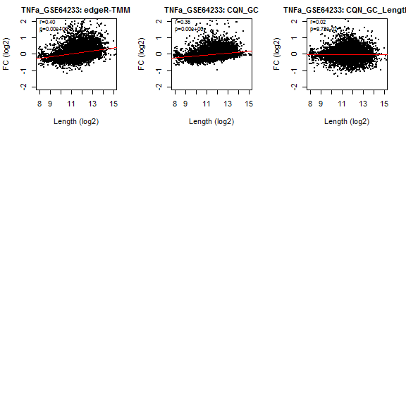

Sample-specific length bias
============================

Imports: cqn, edgeR

All the counts data, length and gc content files are in the Counts_data folder.

TNFa GSE64233 - Example
=========================

Set the R working directory to "RNA-seq_length_bias-master".

The file length\_bias\_analysis.R should be located in the the working directory. The counts file and the length and GC content file should be located in the Counts\_data folder within the working directory.

Step 1 : Filter genes
---------------------

Create the filtered counts file with genes that have at least 1.0 cpm in all replicates of at least one biological condition, and have length and GC content data. The output is a file with the suffix "cnts\_data\_Pgenes.txt". This file will be used as the counts file input for the following steps.

``` r
source("length_bias_analysis.R")
N.replicates <- 3
Conds <- list("control"=1:N.replicates, "treatment"=(N.replicates+1):(N.replicates*2))
Tx.LenFile <- "Counts_data/Hs_Ens_v96_APLen_forPCgenes_MaxTxLenForRest_plus_GCcontent.txt";
countsFile <- "Counts_data/GSE64233_Counts.txt"
DatasetTitle <- "TNFa_GSE64233"
identify_genes_with_leninfo_and_cpm_above_thresh (countsFile, Conds,N.samples.cutoff=N.replicates,
                                                  CPM.CUTOFF=1.0, Tx.LenFile,
                                                  DatasetTitle=DatasetTitle) 
```

    ## 
    ## Num of genes passing filter:  12135 
    ## 
    ## 
    ## Writing Pgenes count file to TNFa_GSE64233_cnts_data_Pgenes.txt
    ## 
    ## 

Step 2 : compare biological conditions
--------------------------------------

The counts file is the filtered counts file from the previous step (cnts\_data\_Pgenes.txt file) and it need to be located in the wd. The output includes 2 files: treatment\_vs\_control\_analysis\_results.txt   biological\_conditions\_analysis\_plots.pdf

``` r
countsFile.Pgenes <- ("TNFa_GSE64233_cnts_data_Pgenes.txt")
length_bias_analysis_compare_biological_conditions(countsFile.Pgenes, Tx.LenFile,
                                                   DatasetTitle=DatasetTitle,
                                                   X.lim=c(8, 15), Y.lim=c(-2,2)) 
```


    ## 
    ## Results recorded in TNFa_GSE64233_treatment_vs_control_analysis_results.txt
    ## 

    ##                 RPKM RPKM.qnorm edgeR.TMM edgeR.RLE RLE.RPKM   UQ.RPKM
    ## Spearman.r 0.4255115  0.3532551 0.3958778  0.397017 0.394832 0.3920928
    ## pval       0.0000000  0.0000000 0.0000000  0.000000 0.000000 0.0000000

Step 3 : compare replicate samples
----------------------------------

The counts file is the filtered counts file from the step 1 (cnts\_data\_Pgenes file) and it need to be located in the wd. The analysis here is comparing treatment replicates. For analysis on the control replicates, set the variable Rep.first.col to 2. The output includes 2 files: replicate\_samples\_analysis\_results.txt   replicate\_samples\_analysis\_plots.pdf

Note that for this dataset the FC calculation is opposite (eg. rep3vs1 instead of rep1vs3) to the FC depicted in the main paper.   

``` r
Rep.first.col <- N.replicates + 2
length_bias_analysis_compare_replicate_samples(countsFile.Pgenes, Tx.LenFile,N.replicates=N.replicates,
                                               DatasetTitle=DatasetTitle, Rep.first.col=Rep.first.col,
                                               X.lim=c(8, 15), Y.lim=c(-2,2)) 
```



    ## 
    ## Results recorded in TNFa_GSE64233_replicate_samples_analysis_results.txt
    ## 

    ##             r.rep2vs1  r.rep3vs1   r.rep3vs2 p.rep2vs1 p.rep3vs1
    ## edgeR.TMM  -0.3925942 -0.4612455 -0.07632911         0         0
    ## RPKM       -0.4172103 -0.4614282 -0.02441696         0         0
    ## RPKM.qnorm -0.3544737 -0.4050252 -0.02947935         0         0
    ## RLE.RPKM   -0.4010907 -0.4694072 -0.09334458         0         0
    ## UQ.RPKM    -0.4083818 -0.4714776 -0.08207404         0         0
    ##               p.rep3vs2
    ## edgeR.TMM  3.772723e-17
    ## RPKM       7.147957e-03
    ## RPKM.qnorm 1.163065e-03
    ## RLE.RPKM   6.745987e-25
    ## UQ.RPKM    1.358926e-19

Step 4 : compare biological and replicate samples after cqn normalization
-------------------------------------------------------------------------

The counts file is the filtered counts file from the step 1 (cnts\_data\_Pgenes.txt file) and it need to be located in the wd. This analysis is comparing treatment replicates. For analysis on the control replicates, set the variable Rep.first.col to 2. The output includes 4 files: cqn\_replicate\_samples\_analysis\_results.txt   CQN\_replicate\_samples\_analysis\_plots.pdf   cqn\_treatment\_vs\_control\_analysis\_results.txt   CQN\_biological\_conditions\_analysis\_plots.pdf

``` r
length_bias_analysis_cqn_normalization (countsFile.Pgenes,Tx.LenFile,N.replicates=N.replicates,
                                        DatasetTitle=DatasetTitle, Rep.first.col=Rep.first.col,
                                        X.lim=c(8, 15), Y.lim=c(-2,2)) 
```


    ## 
    ## Results recorded in TNFa_GSE64233_cqn_replicate_samples_analysis_results.txt
    ## 

    ## 
    ## Results recorded in TNFa_GSE64233_cqn_treatment_vs_control_analysis_results.txt
    ##  
    ## cqn treatment vs control analysis results:
    ##            edgeR.TMM    CQN_GC CQN_GC_Length
    ## Spearman.r 0.3958778 0.3595879    0.01503866
    ## pval       0.0000000 0.0000000    0.09760719
    ## 
    ## cqn replicates results:
    ##                 r.rep2vs1   r.rep3vs1   r.rep3vs2    p.rep2vs1
    ## edgeR.TMM     -0.39259422 -0.46124555 -0.07632911 0.0000000000
    ## CQN_GC        -0.40241632 -0.38927306  0.05541793 0.0000000000
    ## CQN_GC_Length  0.03062217  0.03399321  0.01584475 0.0007415161
    ##                  p.rep3vs1    p.rep3vs2
    ## edgeR.TMM     0.0000000000 3.772723e-17
    ## CQN_GC        0.0000000000 1.003525e-09
    ## CQN_GC_Length 0.0001801397 8.092021e-02


Replicate samples comparison:

(TNFa_GSE64233_CQN_replicate_samples_analysis_plots.pdf) 



Biological conditions comparison:

(TNFa_GSE64233_CQN_biological_conditions_analysis_plots.pdf) 


